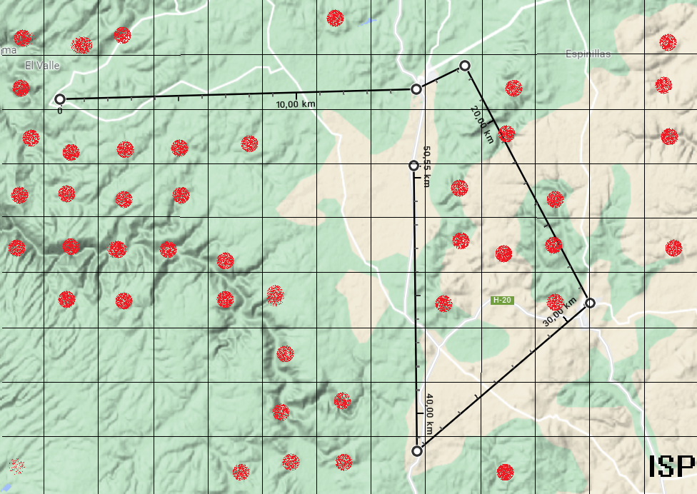
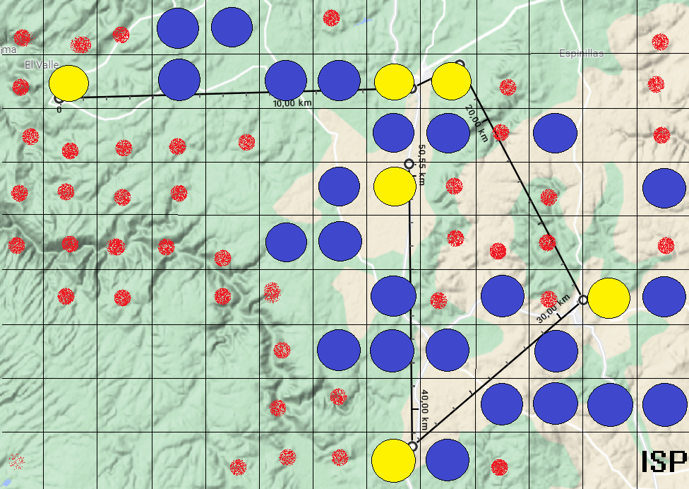
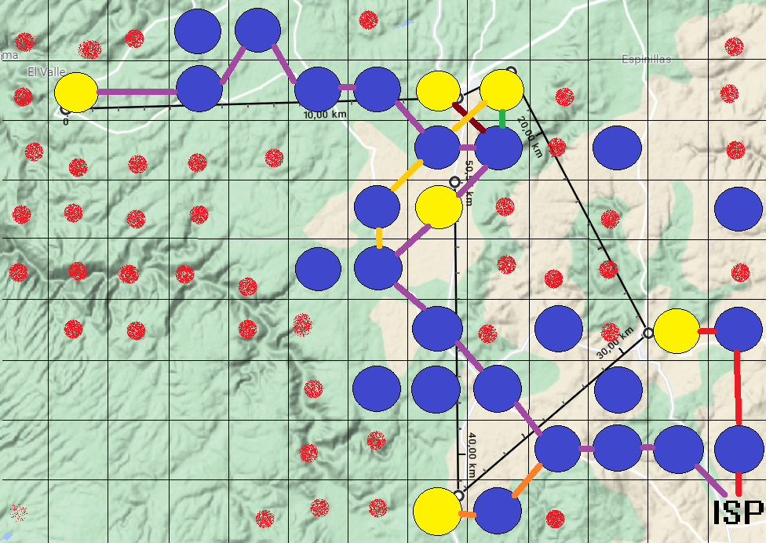
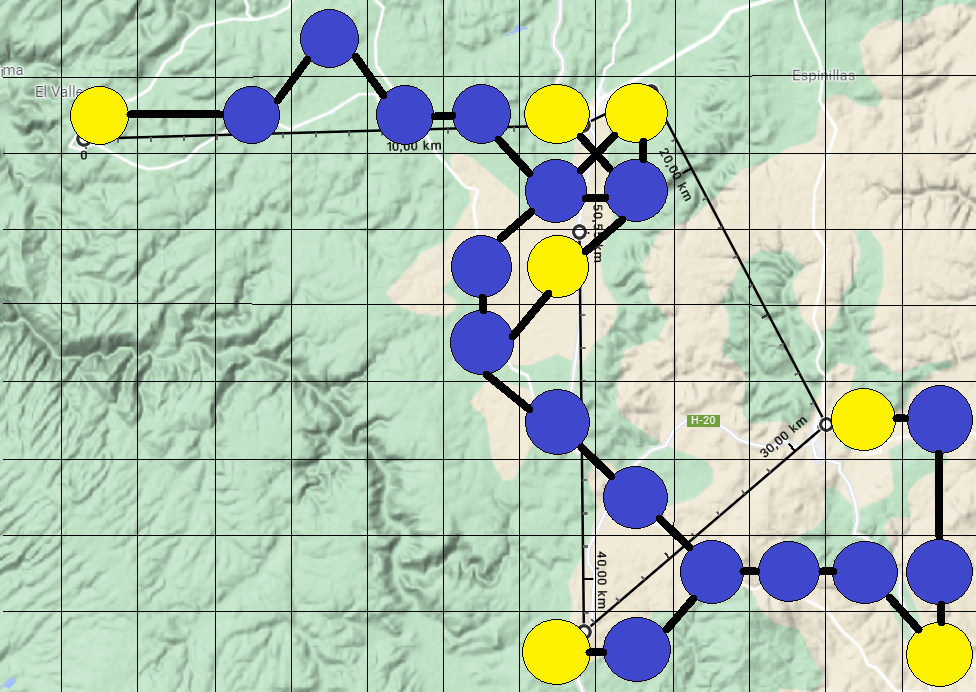

# Asignación-topológica-en-comunidades-rurales
[TEL343] Planificación y dimensionamiento de redes, proyecto semestral. 

## Descripción

Obtención de topología de red para una red óptica inalámbrica que realiza la comunicación utilizando FSOs. La topología es resultado de un algoritmo genético desarrollado por los integrantes de este equipo.

## Algoritmo

* (1) Generar población (ubicaciones de FSOs).
* (2) Obtención de rutas a partir de la población generada.
* (3) Obtención de bit rates de los pueblos según rutas obtenidas (distancias de enlaces).
* (4) Calcular Fitness de la topología actual.
* (5) CrossOver (entre nueva población generada y la mejor población obtenida hasta ahora).
* (6) Mutación
* (7) Volver al punto 2 o terminar de iterar.

## Resultados (50 iteraciones)

